<h1 align="center">   </h1>

<h1 align="center" color="pink" > 🐺 Origamid  . </h1>

Repositorio criado para estudos Front-End: Web Design, UX/UI Design, HTML, CSS, JavaScript, React e Vue.  
 

 

<h2 align="center"> 🎨 I - Introdução UI Design - Praticando clones </h2>

 🍃 Layout - Natureza
<h1 align="center">  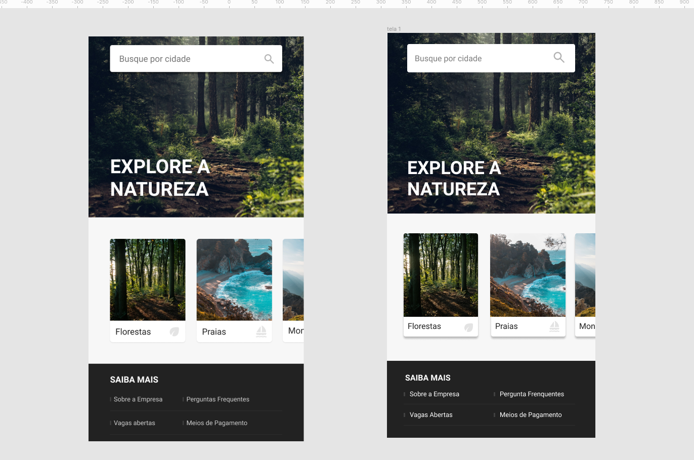 </h1>

 ✨ Layout - Formulário
<h1 align="center">  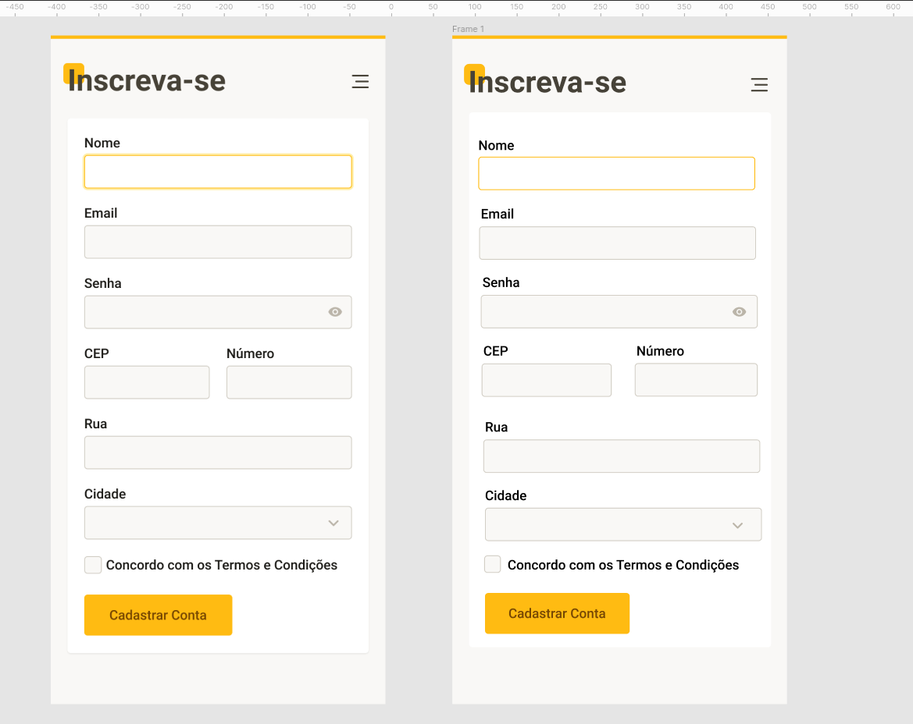 </h1>

 👧 Layout - Perfil
<h1 align="center">  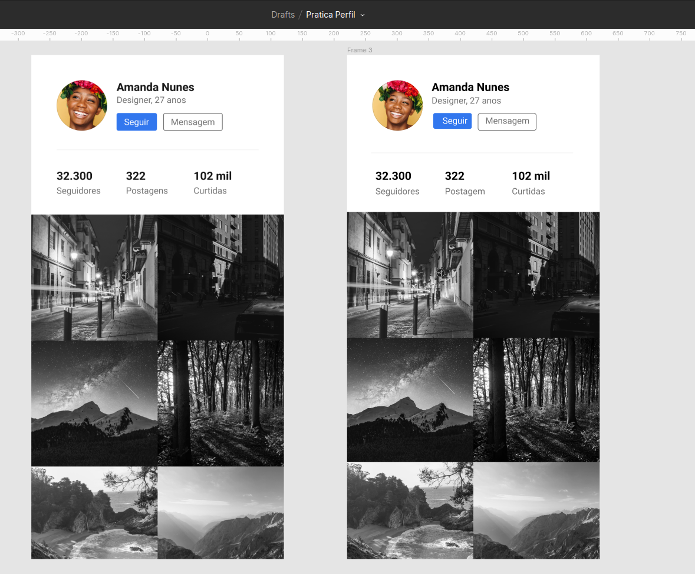 </h1>

💰 Layout - Finanças
<h1 align="center">  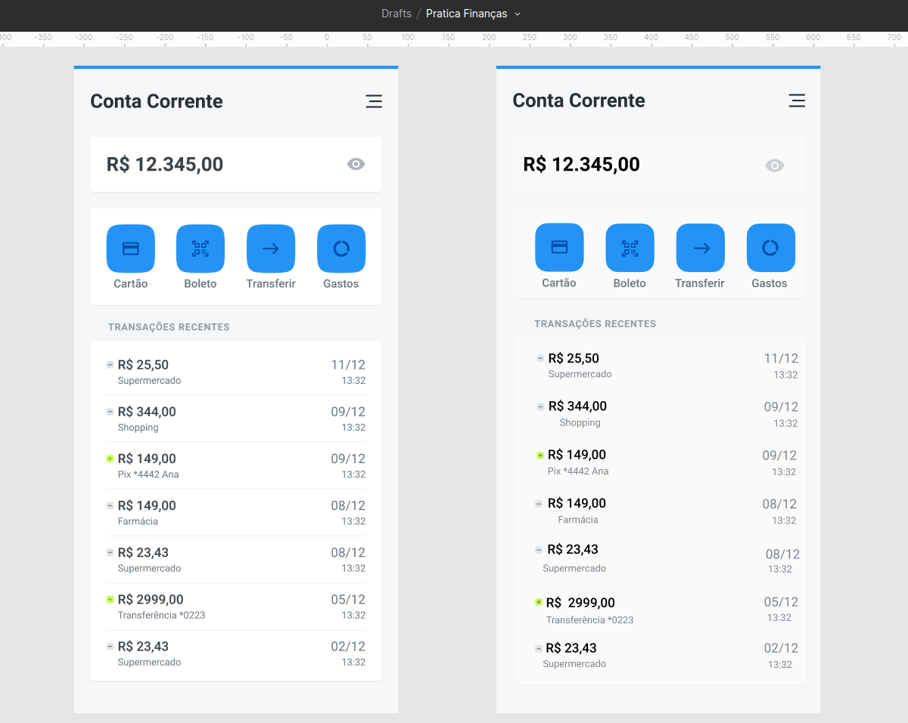 </h1>

<h3 align="center"> 🎨 UI Design - Espaço - Prática </h3>

O principal uso do elemento espaço serve para definição de uma relação lógica entre os elementos.

📜 Layout Espaço - Redesenho
<h1 align="center">  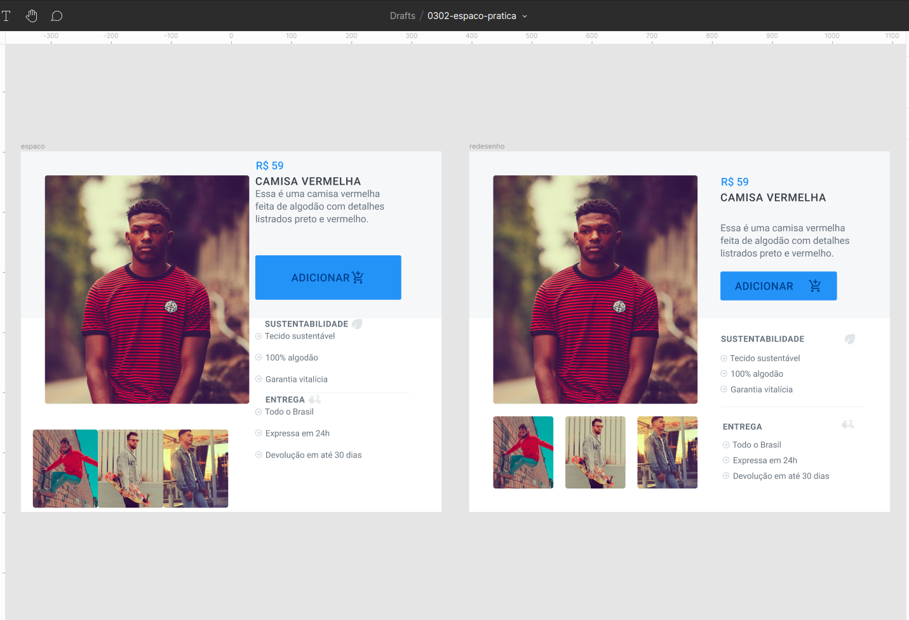 </h1>

<h3 align="center"> 🎨 UI Design - Paleta de Cores - Prática </h3>

 Para toda cor que decidirmos utilizar no projeto, lembrar que variação será essencial para compor a interface. A variação da cor geralmente ocorre na diagonal da matriz HSB. 

🖌️ Layout Cores
- Antes
<h1 align="center">  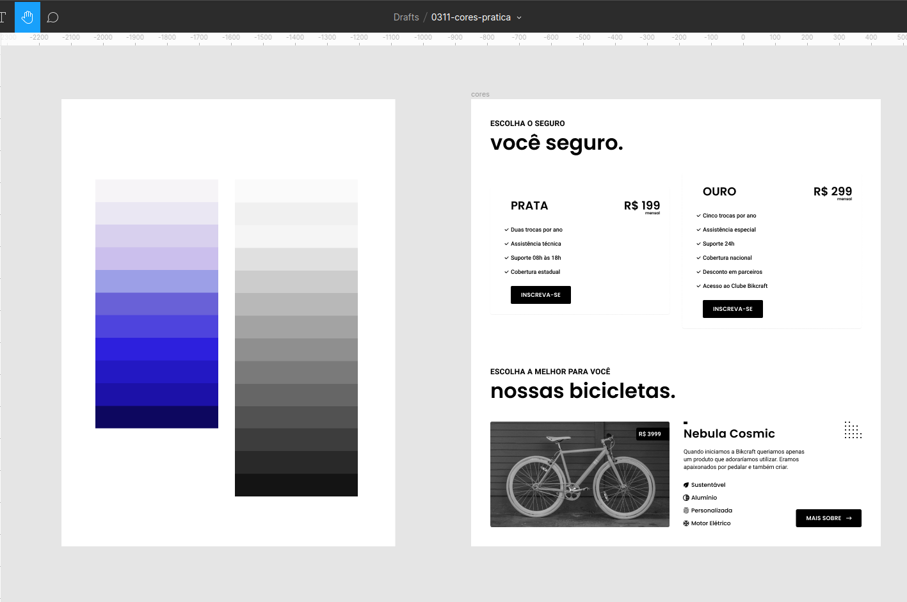 </h1>

- Depois
<h1 align="center">  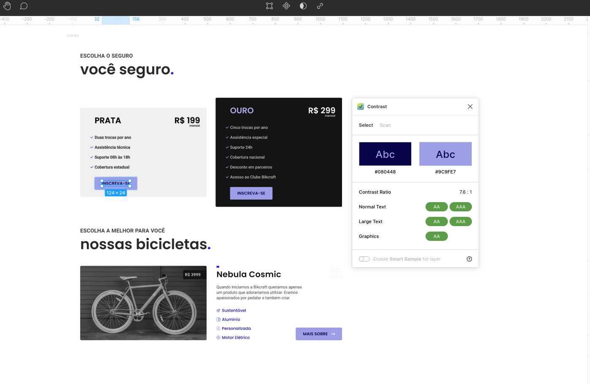 </h1>

<h3 align="center"> 🎨 UI Design - Navegação Componentes - Prática Navegação </h3>

 Geralmente a anatomia do menu Principal(Header) é composta por Marca, Menu e Busca mudando de acordo com a necessidade do site. Fundamental compreender a função de cada um e como realizar o design harmonioso.  

🧭 Layout Navegação - Prática

✈️ Protótipo Caravan 
- Antes
<h1 align="center">  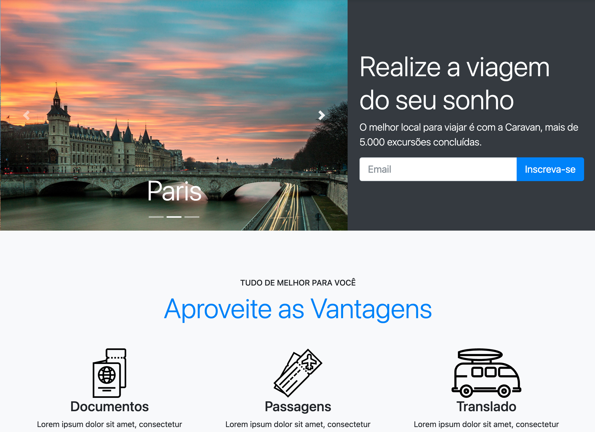 </h1>

- Depois
<h1 align="center">  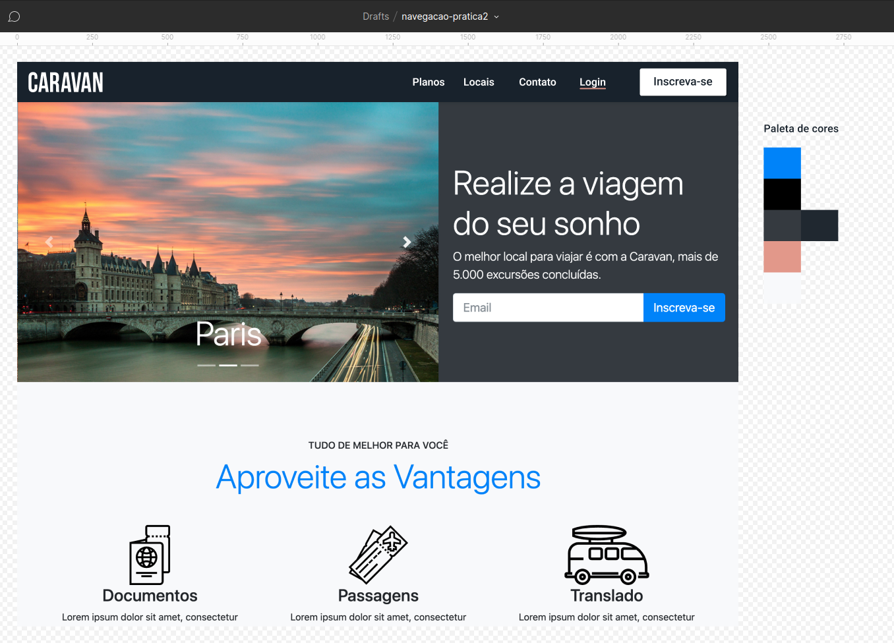 </h1>

 
👚Protótipo Handel 

- Antes
<h1 align="center">  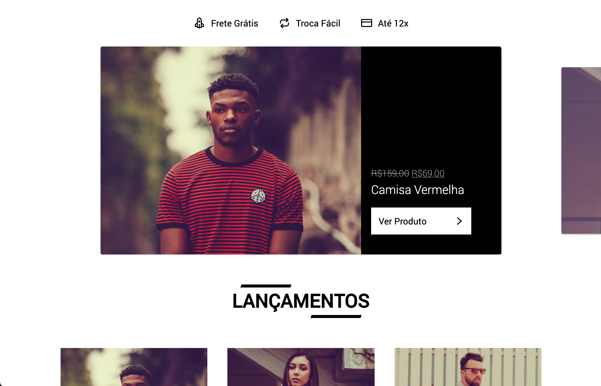 </h1>

- Depois
<h1 align="center">  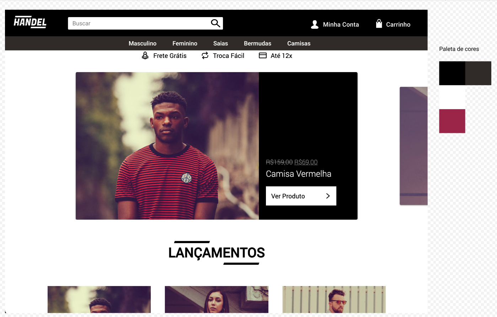 </h1>

Feito com  💙 por 😊 [Joseane Guedes ](https://github.com/Joseane-Guedes) e 🐺 [®️Origamid](https://www.origamid.com/)  